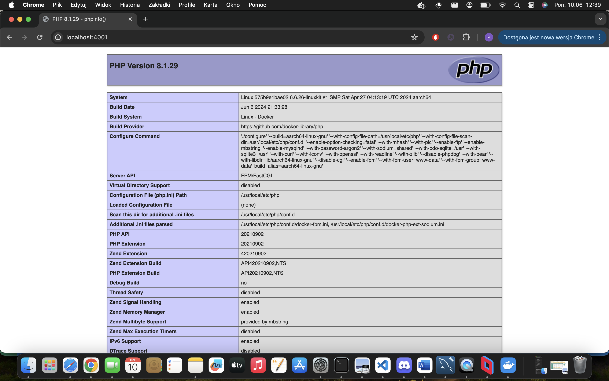
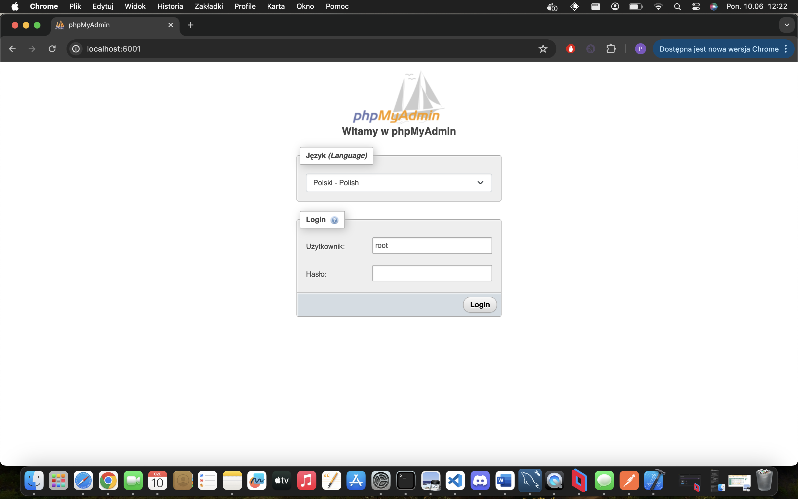
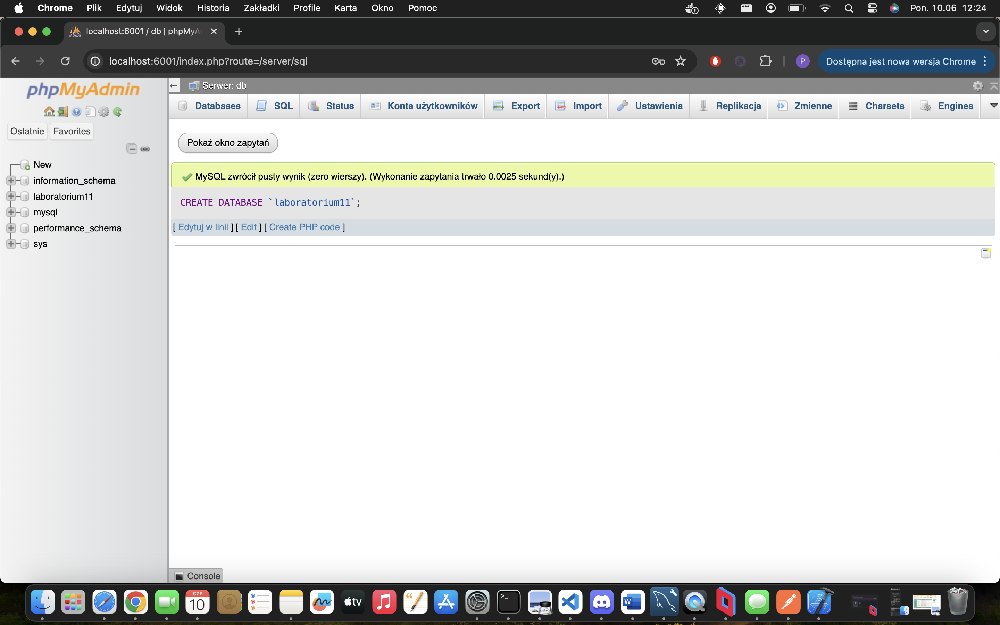

# Uruchomienie

Aby uruchomić aplikację należy w terminalu wpisać polecenie
`docker-compose up -d`

## Działanie nginx

Po wejściu do przeglądarki i wpisaniu 
`localhost:4001` 
Pojawi się strona php uruchomiona przez serwer nginx

## Działanie mysql

Po wejściu do przeglądarki i wpisaniu 
`localhost:6001` 
Pojawi się strona logowania do phpmyadmin uruchomiona przez serwer phpmyadmin

user: root
password: password123

## Dodanie bazy danych

Wykonanie polecenia SQL 
`CREATE DATABASE 'laboratorium11';`
tworzy nową bazę danych

